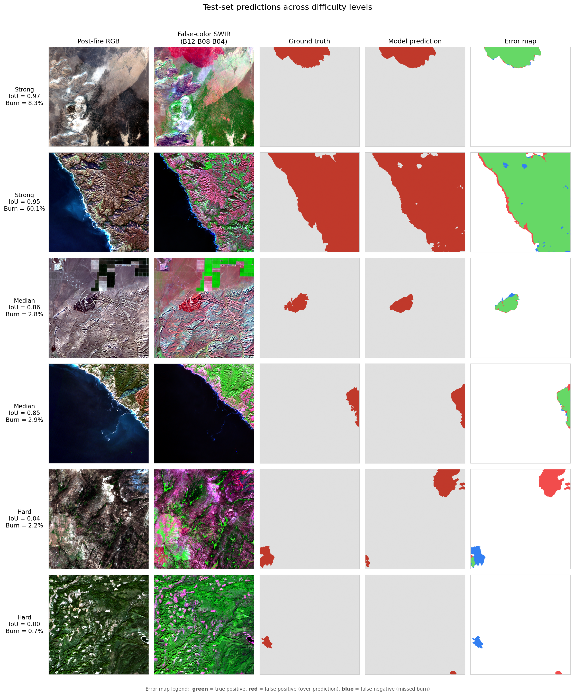

# Sentinel-2 Burned Area Segmentation

Deep-learning segmentation of wildfire burn scars from Sentinel-2 satellite imagery, using a U-Net trained on the CaBuAr dataset of California wildfires (2015–2022).

## Results



Evaluation on 80 held-out patches (45 fires the model never saw during training):

| Metric           | Value  |
|------------------|--------|
| Test IoU (aggregate)        | **0.79** |
| Test F1 (Dice)              | 0.88 |
| Test Precision              | 0.84 |
| Test Recall                 | **0.94** |
| Per-sample mean IoU         | 0.59 |
| Median IoU (substantial burns, >5%) | **0.90** |

**Training dashboard:** [Live on Weights & Biases](https://wandb.ai/chavosh-personal/sentinel2-burn-segmentation)

The model catches 94% of true burn pixels and segments substantial burns with high accuracy (median IoU 0.90 on patches with >5% burn coverage). It struggles with very small burns (<0.5% of the patch), an identified limitation discussed below.

## What this project does

Given a Sentinel-2 post-fire image, the model predicts which pixels show burned vegetation, automating the kind of post-fire mapping that traditionally requires ground surveys. The same approach extends naturally to other Earth-observation segmentation tasks: deforestation, flood mapping, land-cover change.

## Methodology

- **Dataset:** [CaBuAr (California Burned Areas)](https://huggingface.co/datasets/DarthReca/california_burned_areas) - Sentinel-2 L2A patches paired with CAL FIRE perimeters rasterized as binary masks.
- **Input:** 6 Sentinel-2 bands (B02, B03, B04, B08, B11, B12). SWIR bands are critical — they carry the burn signal that visible RGB misses.
- **Model:** U-Net with ResNet-34 encoder (ImageNet-pretrained), ~24M parameters, via [`segmentation-models-pytorch`](https://github.com/qubvel/segmentation_models.pytorch).
- **Loss:** Combined BCE + Dice (50/50). BCE keeps gradients flowing per-pixel; Dice handles the 9.8:1 class imbalance.
- **Optimizer:** AdamW (lr=1e-4, weight_decay=1e-4) with cosine LR schedule.
- **Splits:** **Geographic** patches are grouped by fire UUID so no single fire appears in more than one split. Prevents spatial autocorrelation leakage that random patch splits silently introduce.
- **Hardware:** Single NVIDIA GTX 1050 Ti (4 GB VRAM), ~45 min for 30 epochs.

## Tech stack

- PyTorch 2.6 (CUDA 12.4) + segmentation-models-pytorch (U-Net, ResNet-34 encoder)
- h5py + hdf5plugin for CaBuAr HDF5 ingestion; numpy `.npy` cache for fast training (36× speedup)
- rasterio, pyproj, shapely, geopandas for geospatial I/O and CRS handling
- pandas for splits and per-sample analysis
- albumentations for augmentation (geometric-only: flips + 90° rotations)
- torchmetrics for IoU, F1, precision, recall
- PyYAML for configuration (`configs/baseline.yaml`) with CLI overrides
- Weights & Biases for experiment tracking and prediction visualization
- matplotlib for results figures
- Jupyter for data exploration and band statistics
- Hugging Face Hub (`snapshot_download`) for dataset acquisition
- uv for environment and dependency management (Python 3.11)
- Git + GitHub for version control

## Reproduction

```bash
# Setup (requires uv: https://github.com/astral-sh/uv)
git clone https://github.com/Chavoshh/sentinel2-burn-segmentation
cd sentinel2-burn-segmentation
uv sync

# Get the dataset and preprocess it (~3 GB cache for fast training)
uv run python scripts/download_data.py
uv run python scripts/preprocess_data.py

# Train (~45 min on GTX 1050 Ti)
uv run python scripts/train.py --config configs/baseline.yaml

# Evaluate the trained model on the test set
# Replace <run-id> with your actual W&B run ID (look in the `models/` folder after training)
uv run python scripts/evaluate.py --checkpoint models/<run-id>/best.pt

# Generate the results figure
uv run python scripts/make_results_figure.py --checkpoint models/<run-id>/best.pt
```

The geographic split is generated by `notebooks/01_data_exploration.ipynb`, which also computes the per-band normalization constants used by the preprocessing.

## Project structure
```text
sentinel2-burn-segmentation/
|-- configs/baseline.yaml          # training hyperparameters
|-- notebooks/
|   `-- 01_data_exploration.ipynb  # dataset analysis, split, band stats
|-- scripts/
|   |-- download_data.py           # fetch CaBuAr from Hugging Face
|   |-- preprocess_data.py         # HDF5 -> .npy cache (36x faster training)
|   |-- train.py                   # CLI entry point
|   |-- evaluate.py                # checkpoint evaluation on any split
|   |-- analyze_per_sample.py      # per-patch IoU distribution
|   `-- make_results_figure.py     # generates docs/results_grid.png
|-- src/
|   |-- data/                      # Dataset, transforms, splits
|   |-- models/                    # U-Net factory
|   `-- training/                  # train loop, losses, metrics
`-- docs/                          # figures and result JSONs
```

## Limitations and next steps

- **Small burns are hard.** On patches with <0.5% burn coverage, median IoU drops to 0.18. Possible fixes: lower prediction threshold (0.3 instead of 0.5), oversample high-burn patches during training, or use a Focal-Tversky loss with higher emphasis on recall.
- **California-only.** Trained and evaluated entirely on California fires; generalization to other ecoregions (Mediterranean shrubland, boreal forest, Australian eucalypt) is unverified.
- **Single-image input.** Currently uses only post-fire imagery. The dataset also includes pre-fire imagery; a change-detection variant (pre+post) is the natural v2 extension.

## References

- Cambrin, D. R., Colomba, L., & Garza, P. (2023). [CaBuAr: California Burned Areas dataset for delineation](https://huggingface.co/datasets/DarthReca/california_burned_areas). *IEEE Geoscience and Remote Sensing Magazine*.
- Dataset license: CC-BY-NC 4.0

## Author

**Chavosh Almassian** | Remote Sensing & Geoinformatics (M.Sc., KIT)
[GitHub](https://github.com/Chavoshh) . [LinkedIn](https://www.linkedin.com/in/chavoshalmassian)

## License

MIT (see `LICENSE`)